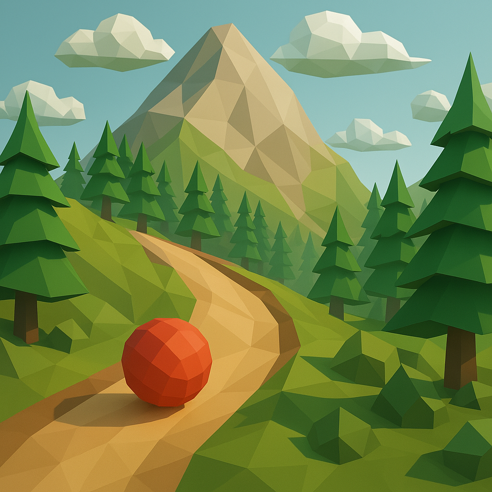

# Low-Poly Mountain Ball Game

A stylized 3D downhill rolling ball game built with Three.js and Cannon.js physics. Control a red ball down colorful low-poly mountain terrain, inspired by minimalist geometric design.



*A low-poly mountain landscape with a red ball rolling down stylized terrain*

## Description

Roll down a procedurally generated low-poly mountain, following winding paths through stylized pine forests. The game features:

- Vibrant low-poly landscape with mountains, paths, and pine trees
- Physics-based ball movement with realistic gravity and collisions
- Smooth camera that follows ball movement
- Checkpoint goals to reach
- Compatible with desktop and mobile devices

## Installation

1. Clone this repository
2. Install dependencies:
```bash
npm install
```
3. Run development server:
```bash
npm run dev
```
4. Build for production:
```bash
npm run build
```

## Controls

- **Desktop**: Arrow keys or WASD to control the ball
- **Mobile**: On-screen joystick
- **Reset**: Press 'R' key or tap reset button on mobile
- **Debug Mode**: Add '#debug' to the URL to enable GUI controls and free camera (toggle with 'C' key)

## Project Structure

### Core Files

- `main.js` - Entry point that sets up the game environment, handles input, and manages the game loop
- `Ball.js` - Implements the physics-based ball with visual style
- `PhysicsWorld.js` - Cannon.js physics system for terrain collision and gravity
- `chunk.js` - Terrain chunk renderer with stylized shaders
- `chunkManager.js` - Manages terrain chunks with physics and LOD (Level of Detail)
- `heightGenerator.js` - Creates stylized mountainous terrain with paths
- `trees.js` - Generates low-poly stylized pine trees

### Class Responsibilities

| Class | Purpose |
|-------|---------|
| Ball | Creates and manages a physics-based ball with low-poly visuals. Handles forces, movement, and collision detection. |
| PhysicsWorld | Manages the Cannon.js physics system, creating collision meshes from terrain geometry and handling physics simulation. |
| Chunk | Renders a single terrain chunk with stylized shaders, generates appropriate geometry and textures. |
| ChunkManager | Manages multiple terrain chunks around the player, handling loading/unloading and LOD transitions. |
| Trees | Generates stylized pine trees as instanced meshes for performance. |

## Features

### Procedural Terrain Generation

The terrain is generated procedurally using simplex noise with multiple octaves. The `heightGenerator.js` file creates a coherent mountain landscape with natural-looking paths.

### Low-Poly Visual Style

All elements use flat shading and low-poly geometry to create a stylized look. Custom shaders add color based on height, creating a smooth transition between regions (path, grass, mountain sides, snow peaks).

### Physics-Based Movement

Ball movement is driven by a realistic physics simulation using Cannon.js. Physics bodies are created for terrain chunks, and the ball interacts with the terrain using forces and collisions.

### Adaptive Level of Detail

Terrain chunks use different resolution meshes based on distance from the player, balancing visual quality and performance.

## Dependencies

- Three.js - 3D rendering
- Cannon.js - Physics simulation
- GSAP - Animations
- Simplex-noise - Procedural terrain generation

## Credits

- Inspired by stylized low-poly art and casual rolling ball games
- Built with Three.js and Cannon.js

## License

MIT